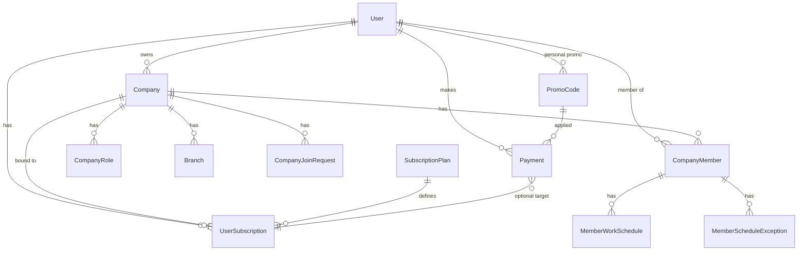

# Архитектура

## Обзор

Многослойная архитектура:

```
HTTP (FastAPI routes)
    ↓
Dependencies (JWT, TenantContext, require_permission, require_platform_admin)
    ↓
Services (бизнес-правила)
    ↓
TenantRepository / прямые запросы SQLAlchemy
    ↓
PostgreSQL
```

Два уровня доступа:
- **Компания (tenant)** — изоляция по `company_id`, RBAC через роли
- **Платформа (admin)** — глобальный доступ для `is_platform_admin`

## Диаграмма сущностей



## Основные сущности

### User
Зарегистрированный пользователь. Флаг `is_platform_admin` — доступ к глобальной админ-панели.

### Company
Компания с владельцем (`owner_id`). Профиль: название, страна, город, адрес, телефон, тип организации (`ip`, `self_employed`, `llc`), график работы (JSON), логотип, галерея фото студии. **Реквизиты** (`CompanyRequisites`) — отдельная запись: название для документов, ИНН, КПП, email для счетов. **Онлайн-запись:** `booking_slug`, `public_booking_enabled`, публичный API `/public/booking/{slug}` для клиентов без авторизации. Привязана к одной `UserSubscription` через `company_id` в подписке.

### UserSubscription
Слот подписки пользователя. До создания компании `company_id = null`. Лимиты компании берутся из `plan_id`. Поддерживает отложенный даунгрейд (`scheduled_plan_id`, `scheduled_change_at`).

### SubscriptionPlan
Тариф: лимиты и `price_monthly`.

### Payment
Платёж за подписку. Поля `original_amount`, `discount_amount`, `promo_code_id`. Действие: `purchase`, `renew`, `change_plan`.

### PromoCode
Промокод со скидкой в процентах. Может быть персональным (`user_id`) или для всех. Ограничения: тарифы, типы оплаты, срок, лимит использований.

### CompanyRole
Роль в компании с `permissions: JSONB` (список кодов прав).

### CompanyMember
Участник компании. Составной FK `(company_id, role_id) → company_roles`.

### CompanyJoinRequest
Приглашение по email. Принимается в личном кабинете.

### MemberWorkSchedule
Расписание слотов специалиста: период, окно времени, интервал, паттерн (`weekly` / `cycle` / `manual`).

### MemberScheduleException
Исключение: `day_off` или `slot_block`. Даты — один день (`exception_date`), диапазон (`exception_date` + `exception_date_to`) или список (`exception_dates`), не более 365 дней размаха.

### CompanyService
Услуга компании: название, категория, описание, `duration_minutes` (5–480), буферы до/после (`0`, `5`, `10`, `15`, `30` мин), опционально цена, исполнитель (`member_id`) или филиал.

### MemberAppointment
Запись клиента на услугу у специалиста. Длительность фиксируется на момент создания. Статусы: `scheduled`, `cancelled`, `completed`. Перекрывающие слоты скрываются при выдаче расписания.

### WarehouseItem / WarehouseStock / WarehouseMovement
Склад компании: товары и расходники, остатки по основному складу и филиалам, движения (`receipt`, `issue`, `adjustment`, `transfer`).

### CompanyReview
Отзыв клиента о компании: оценка 1–5, текст, опционально мастер. Рейтинг компании — среднее по видимым отзывам.

## Подписки и платежи

### Модель «слот = компания»

1. Пользователь покупает подписку → `UserSubscription` без `company_id`
2. Создаёт компанию → подписка привязывается
3. Несколько подписок → несколько компаний

### Смена тарифа

- **Апгрейд** — немедленно, если текущее использование вписывается в новые лимиты
- **Даунгрейд** — с даты `expires_at` через `scheduled_plan_id`
- Доступные тарифы: `GET /companies/{id}/subscription/available-plans`

### Промокоды

```
Админ создаёт PromoCode
    ↓
Клиент: POST /payments/checkout/preview { promo_code }
    ↓ (экран подтверждения)
POST /payments/checkout { promo_code }
    ↓
complete_payment → register_promo_usage (used_count++)
```

### Провайдеры оплаты

| provider | Режим |
|----------|-------|
| `mock` | Автооплата при checkout |
| `yookassa` | Заглушка, webhook |
| `cloudpayments` | Заглушка, webhook |

## RBAC в компании

| Право | Описание |
|-------|----------|
| `manage_roles` | Роли и права |
| `manage_members` | Смена ролей сотрудников |
| `manage_branches` | Филиалы |
| `manage_schedules` | Расписание и исключения |
| `manage_join_requests` | Приглашения |
| `manage_services` | Услуги и записи клиентов |

Владелец (`owner_id`) имеет все права через `TenantContext.has_permission`.

Зависимость `require_permission(code)` — при отсутствии права возвращает **404**.

## Multi-tenant изоляция

### TenantContext

```python
TenantContext(
    company_id, company, user_id,
    is_owner, member, permissions
)
```

Устанавливается в `get_company_tenant(company_id)` из URL.

### TenantRepository

Все операции с ролями, участниками, филиалами, расписанием — только в рамках `company_id`.

### Уровни защиты

1. API — нет доступа к компании → 404
2. Repository — фильтр `company_id`
3. БД — `fk_member_role_same_tenant`, уникальные ограничения tenant

## Расписание

### Генерация слотов

1. `is_working_day(schedule, day)` по паттерну
2. Генерация слотов в окне `time_start`–`time_end` с шагом `slot_interval_minutes`
3. Применение `MemberScheduleException` (выходной → пусто; блокировки → фильтрация)
4. Исключение слотов, пересекающихся с `MemberAppointment` (с учётом длительности услуги при `service_id`)

### Паттерны

| type | config |
|------|--------|
| `weekly` | `weekday_off`, `extra_off_dates`, `extra_work_dates` |
| `cycle` | `work_days`, `rest_days`, `anchor_date` |
| `manual` | `days: { "YYYY-MM-DD": true/false }` |

## Глобальная админ-панель

Префикс `/api/v1/admin`. Зависимость `require_platform_admin` → 403.

Назначение админов:
- `PLATFORM_ADMIN_EMAILS` при старте (`promote_platform_admins`)
- `PATCH /admin/users/{id}/platform-admin`

Промокоды, дашборд, списки пользователей/компаний, объявления о техработах — только админы.

Объявления (`PlatformAnnouncement`) публикуются для всех пользователей платформы через кабинет и `/announcements`.

## Техподдержка платформы

| Роль | Флаг | Доступ |
|------|------|--------|
| Администратор | `is_platform_admin` | Всё в `/admin/*` + тикеты |
| Техподдержка | `is_platform_support` | `/admin/support/*` |
| Пользователь | — | `/support/*` (свои тикеты) |

Назначение support:
- `PLATFORM_SUPPORT_EMAILS` при старте (`promote_platform_support`)
- `PATCH /admin/users/{id}/platform-support` (только админ)

Модели: `SupportTicket`, `SupportTicketMessage`. Статусы: `open`, `in_progress`, `waiting_user`, `resolved`, `closed`.

Зависимость `require_platform_staff` = admin OR support.

## Развёртывание

```
docker compose up --build
```

| Сервис | Образ | Порт |
|--------|-------|------|
| `db` | postgres:16-alpine | 5432 (internal) |
| `api` | Dockerfile | 8000 |

Entrypoint: `scripts/docker_entrypoint.py` — ожидание БД, `alembic upgrade head`, uvicorn.

## Миграции

| Rev | Содержание |
|-----|------------|
| 001 | Базовая схема |
| 002 | Tenant isolation (FK, constraints) |
| 003 | Платежи, кабинет, join requests |
| 004 | Единая модель подписок (UserSubscription) |
| 005 | RBAC permissions, member_work_schedules |
| 006 | Исключения расписания |
| 007 | Platform admin, промокоды |
| 008 | Диапазоны и списки дат в исключениях расписания |
| 009 | Техподдержка: `is_platform_support`, тикеты и сообщения |
| 010 | Услуги компании и записи клиентов |
| 011 | Лимиты записей/услуг, приглашения, оплата труда |
| 012 | Фото компании и профиля сотрудника |
| 013 | Объявления платформы (техработы) |

## Безопасность

- Пароли: bcrypt
- API: JWT Bearer
- Tenant: 404 вместо 403 для чужих компаний
- Admin: отдельный флаг, не связан с ролями компании
- Support: отдельный флаг; staff видит все тикеты, пользователь — только свои

## Планируемое расширение

- Модуль записи клиентов (appointments)
- Полная интеграция ЮKassa
- Уведомления (email/push) по приглашениям
